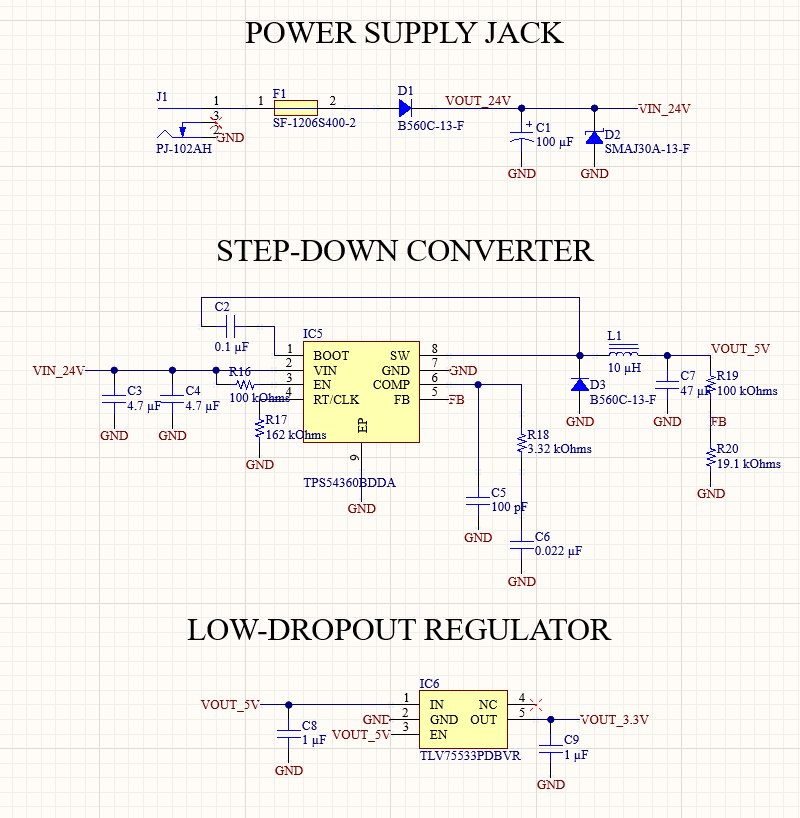
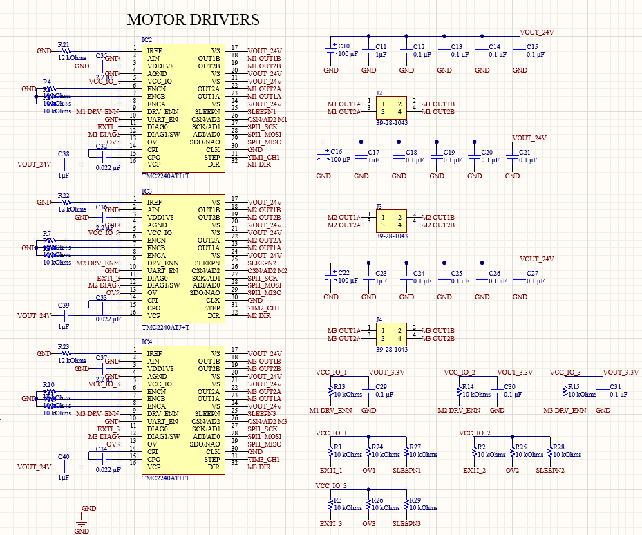
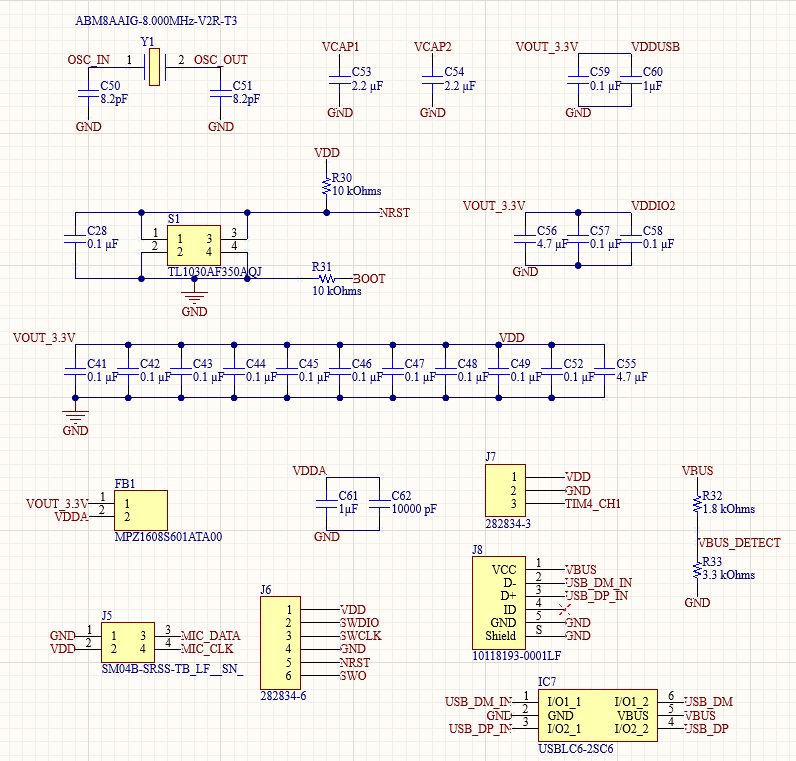
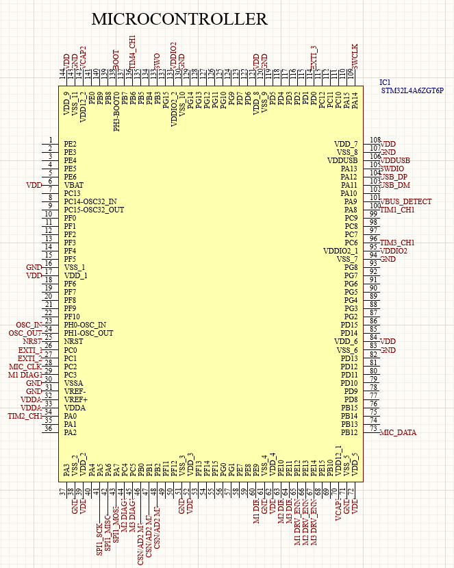
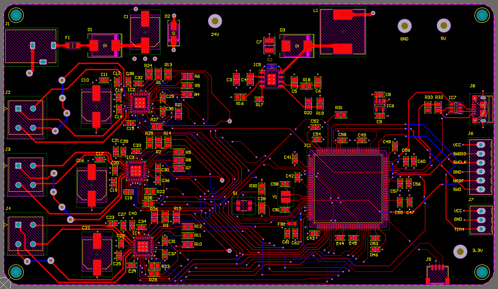
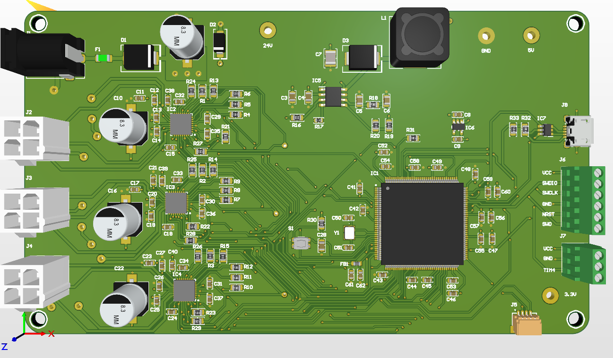

# ME507 — Voice & Vision Controlled 3-DoF Robotic Arm

By: Evan Tran, Lucas Kaemmerer

ME 507 - Charlie Refvem

California Polytechnic State University, San Luis Obispo

#### Overview


@image html final_arm.jpg "Robot Arm" width=50%

<p align="center">
  Figure 1. Robot Arm Structure
</p>

This page covers the documentation and codebase for a 3 degree-of-freedom (RRR) robotic arm that picks colored blocks on spoken command. A spoken color is recognized on the host PC, computer vision locates the matching block, the block's location is transformed into the arm's coordinate frame, and the target is streamed over USB to an STM32, which solves inverse kinematics and drives three closed-loop stepper joints plus a gripper to complete the pick. The arm runs using 2 NEMA 17 stepper motors and a NEMA 23 stepper motor, all driven by 3 TMC2240 driver + motion controller chips. It has a cheap servo motor for the end effector. The microcontroller is a STM32L4A6ZG (144 pin).

More code details hosted at the documentation page: ([page link](https://psp-player.github.io/ME507/)).

---

Video of Arm Function:

[](https://youtu.be/eV6sloEoMP8)


---

## Table of Contents
- [System Overview](#system-overview)
- [Hardware](#hardware)
- [Software Implementation](#software-implementation)
- [Mathematical & Physical Modeling](#mathematical--physical-modeling)
- [Repository Structure](#repository-structure)
- [Build & Run](#build--run)

---

## System Overview

The project splits across two processors connected by a single USB CDC serial
link:

| Stage | Where | Responsibility |
|-------|-------|----------------|
| Voice recognition | Host PC (Python, Vosk) | Map a spoken word to one of the enabled colors |
| Block detection | Host PC (Python, OpenCV) | Find the largest block of that color in the camera frame |
| Coordinate transform | Host PC | pixel → table (homography) → robot frame (affine) |
| Inverse kinematics & motion | STM32 (C firmware) | Solve IK, generate coordinated stepper motion, drive the gripper |

The PC sends an ASCII command (`M,<COLOR>,<X>,<Y>,<Z>\n`); the firmware performs the motion and replies `DONE` or `ERR`. Keeping IK and real-time step generation on the MCU means the host never has to meet hard timing deadlines.

<!-- TODO: a block diagram of the full pipeline reads very well here -->
<!--  -->

---

## Hardware

### Actuators
- **Three stepper-driven joints (base, shoulder, elbow).** Each joint is a NEMA-frame stepper run at 16× microstepping.
  <!-- TODO: confirm exact motor part numbers, e.g. NEMA 17 (base/elbow) and NEMA 23 (shoulder) -->
- **TMC2240 stepper drivers (one per joint).** SPI-configurable drivers read back over SPI.
  Run/hold currents are tuned **per joint** in firmware — the shoulder, which carries the most load, runs at maximum current in its range, while the lighter base and elbow run lower to stay cool.
- **Hobby servo gripper.** A single RC servo on a 50 Hz PWM channel (TIM4 CH2), with calibrated open/close pulse widths.

### Sensors
- **PDM MEMS microphone** routed into the STM32's DFSDM peripheral with DMA, for on-board audio capture. This was the initial plan, but we ended up using the usb mic because we weren't able to get the tinyml on stm32 working in time. The mic we ordered for the DFSDM was also bad.
  <!-- TODO: confirm mic part (e.g. Adafruit PDM MEMS) -->
- **USB webcam** on the host PC for block detection and workspace calibration.
- **TMC2240 driver telemetry** — each driver's `DRV_STATUS` register is readable over SPI, providing stall and fault flags that act as motion sensing.

### Custom PCB
A custom 4-layer board carries the MCU, the three TMC2240 drivers, power regulation, and connectors for the motors, microphone, and USB.

- **Power:** a buck converter steps the 24 V motor supply down to 5 V, and an LDO derives the 3.3 V logic rail.
  <!-- TODO: confirm regulators, e.g. TPS54360 buck (24V->5V) + MCP1700 LDO (5V->3.3V) -->
- **USB protection:** an ESD-protection device on the USB data lines.
  <!-- TODO: confirm part, e.g. USBLC6-2SC6 -->
- **Layout:** dedicated power and ground planes, local decoupling at each driver, and short SPI/step/dir routing to the drivers.

<!-- TODO: add PCB renders/photos: schematic, 3D render, and the assembled board -->

<p align="center">
  
</p>

<p align="center">
  Figure 2. PCB schematic sheet 1
</p>

<p align="center">
  
</p>

<p align="center">
  Figure 3. PCB schematic sheet 2
</p>

<p align="center">
  
</p>

<p align="center">
  Figure 4. PCB schematic sheet 3
</p>

<p align="center">
  
</p>

<p align="center">
  Figure 5. PCB schematic sheet 4
</p>

<p align="center">
  
</p>

<p align="center">
  Figure 6. PCB Layout
</p>

<p align="center">
  
</p>

<p align="center">
  Figure 7. PCB 3D Render
</p>

### Mechanical Design
The RRR linkage uses link lengths of **D1 = 145 mm** (base height), **L1 = 170 mm** (upper arm), and **L2 = 245 mm** (forearm, measured to the tool point), giving a workspace of roughly L1 + L2 from the shoulder pivot.

<!-- TODO: add a CAD render and a labeled link-length / DOF diagram -->
<!--  -->

---

## Software Implementation

**Language & structure.** C on the STM32 HAL. All motion logic lives in one module (`arm_control.c`) behind a small Cartesian API (`arm_control.h`); CubeMX's `main.c` handles peripheral setup. Motion state is kept `static` and module-private rather than global.

**How it runs.** A cooperative main loop polls a single "command ready" flag and dispatches commands, while all time-critical step generation happens in timer interrupts. No tasks, no threads — the control flow stays easy to follow and the timing jitter low.

**Notable drivers.**
- **Coordinated motion (`arm_control.c`).** Each joint runs off its own hardware timer, where one update event = one microstep. The joint with the most steps drives a shared trapezoidal velocity profile, and every other joint's rate is rescaled in the ISR so all three start and finish together.
- **TMC2240 SPI driver.** A compact read/write pair handles the 40-bit SPI frames; `arm_drivers_init()` reads back each driver's version byte at startup, so a wiring fault surfaces immediately instead of mid-demo.

### Main Loop & Intelligence
The "intelligence" is split across the two processors by design. The MCU's main loop is a simple command interpreter:

1. Wait for the USB CDC receive ISR to set the `cmd_ready` flag.
2. Parse the ASCII line:
   - `M,<color>,<x>,<y>,<z>` → solve IK and move, then close the gripper on arrival
   - `GRIP,OPEN` / `GRIP,CLOSE` → actuate the gripper
   - `WHERE` → reply with the current tip position from forward kinematics
3. Reply `DONE` on success or `ERR` on an unreachable target / bad command.

The higher-level decision making — *which* color to pick and *where* it is — runs on the host (`voiceplusvision.py`): a Vosk recognizer constrained to a small color grammar sets the target color, OpenCV finds the largest matching blob, and the two-stage coordinate transform produces the robot-frame target that gets sent down the wire.

---

## Mathematical & Physical Modeling

### Inverse & Forward Kinematics
The arm is a base yaw joint followed by a 2-link planar arm (shoulder + elbow).

**Inverse kinematics** (`arm_ik`): the base angle comes straight from the planar projection of the target, `θ₀ = atan2(y, x)`. In the arm plane, with planar reach `r = √(x² + y²)` and height `z' = z − D1`, the elbow angle follows from the law of cosines:

```
D  = (r² + z'² − L1² − L2²) / (2·L1·L2)
θ₂ = atan2(±√(1 − D²), D)          # sign selects elbow-up vs elbow-down
θ₁ = atan2(z', r) − atan2(L2·sinθ₂, L1 + L2·cosθ₂)
```

A target is flagged unreachable when `|D| > 1`. **Forward kinematics** (`arm_fk`) inverts this to report the tip position and is used to answer `WHERE`.

### Motion Profiling (actuation dynamics)
Stepping a motor straight to cruise speed stalls it, so each move uses a **symmetric trapezoidal velocity profile** derived from a constant-acceleration model. From the kinematic relation `v² = v₀² + 2·a·s`, the firmware computes two candidate speeds each master step — one that ramps **up** with distance travelled and one that ramps **down** with distance remaining — and takes the smaller, capped at the cruise rate:

```
v_acc = √(v_start² + 2·a·steps_done)
v_dec = √(v_start² + 2·a·steps_left)
v     = min(v_acc, v_dec, v_max)
```

This yields a clean accelerate → cruise → decelerate motion. Joint angles are converted to microsteps via `STEPS_PER_RAD = 200 · 16 / (2π)`, and the timer auto-reload is computed from the desired step rate against the 1 MHz tick.

### Sensor Data Processing (vision)
The vision pipeline turns camera pixels into robot coordinates in two calibrated stages:

1. **Camera calibration** (`camera_calibration.py`) removes lens distortion using a chessboard and OpenCV's `calibrateCamera`.
2. **Workspace homography** maps undistorted pixels to flat **table** millimetres (`findHomography` on a chessboard lying in the workspace).
3. **Table → robot affine** (`estimateAffine2D`) maps table coordinates into the arm's base frame from a handful of touch-off correspondences, with the mean and max residual reported so a bad calibration is obvious.

Block detection itself converts each frame to HSV, builds a per-color mask (red spans two hue bands because it wraps the hue circle), cleans it with morphological open/close, and takes the largest contour above a minimum area as the target — its centroid is the pixel coordinate fed into the transform chain.

---

## Repository Structure

```
ME507/
├── arm_control.c            # Kinematics, motion profiling, TMC2240 driver
├── arm_control.h            # Public arm API
├── main.c                   # Peripheral init + command-loop application
├── main.h                   # Pin definitions
├── usbd_cdc_if.c/.h         # USB CDC interface (command link)
├── voiceplusvision.py       # Host: voice + vision pick pipeline
├── block_detection.py       # Host: vision-only detect & sort
├── camera_calibration.py    # Host: camera intrinsic calibration
├── Doxyfile                 # Doxygen configuration
├── .gitignore               # Ignores generated docs/build artifacts
├── README.md                # This file
└── .github/workflows/
    └── docs.yml             # CI: builds & publishes Doxygen to GitHub Pages
```

> The Doxygen site is rebuilt and redeployed automatically on every push to
> `main` via GitHub Actions, so the published documentation always tracks the
> latest source.

<!-- TODO (optional, per rubric): reorganize firmware into a CubeIDE-style
     Core/Src, Core/Inc, Drivers/ layout and update the Doxyfile INPUT paths. -->

---

## Build & Run

### Firmware (STM32)
Open the project in STM32CubeIDE, build, and flash to the board over ST-Link. The MCU enumerates as a USB CDC virtual COM port for the command link.

### Host pipeline (Python)
```bash
pip install vosk sounddevice pyserial opencv-python numpy
# download a Vosk model (e.g. vosk-model-small-en-us-0.15) next to the script
python voiceplusvision.py
```
Set `SERIAL_PORT` near the top of the script to the arm's COM port. With the camera running, press `w` to calibrate the workspace, `c` to calibrate the table→robot transform, then say an enabled color to trigger a pick.

---


<!-- TODO: add team member names / acknowledgments / course info -->
*Cal Poly — ME 507*
